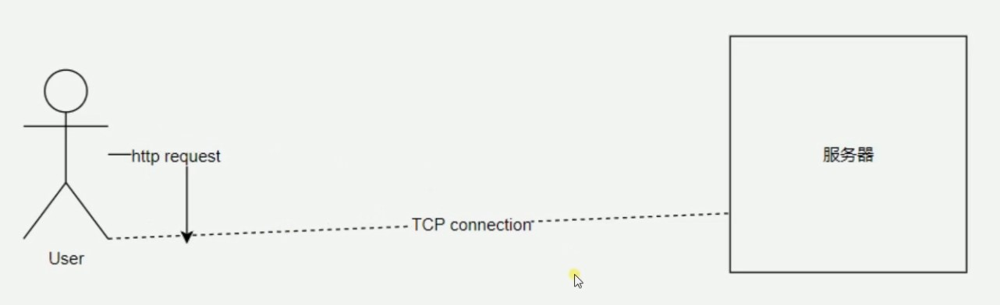

## 5层网络模型

-   HTTP位于应用层

### 低三层

-   物理层主要作用是定义物理设备如何传输数据
-   数据链路层在通信的实体间建立数据链路连接
-   网络层为数据在节点之间传输创建逻辑链路

### 传输层

-   向用户提供可靠的 端 到 端 的服务(End-to-End)
-   传输层向高层屏蔽了下层数据通信的细节

### 应用层

-   为应用软件提供服务
-   构建与TCP协议之上
-   屏蔽网络传输相关细节

## HTTP协议历史

### HTTP/0.9

-   只有一个命令GET
-   没有HEADER等描述数据的信息
-   服务器发送完毕，就关闭TCP连接

### HTTP/1.0

-   增加了命令
-   增加了 STATUS CODE  和  HEADER
-   多字符集支持，多部份发送，权限，缓存等

### HTTP/1.1

-   支持持久连接（创建连接时间多）
-   pipeline  一次可以发送多次请求
-   增加host 和其他命令

### HTTP2（未普及）

-   所有数据以二进制传输
-   同一个链接里面发送多个请求不在需要按照顺序来
-   头信息压缩（头信息占用带宽较多） 以及推送等提高效率的功能（服务端可以主动发动传输）

## HTTP三次握手

-   HTTP只有 请求 与 相应 的功能
-   在客户端与服务器 连接需要建立 **TCP connector**  连接通道

-   时序图
-   SYN 为标志位 ，创建数据包    Seq

-   若不采用三次握手而是两次，当发生网络延迟，服务器向客户端发出响应不及时或丢失，客户端无法知道服务端是否开启端口，连接服务；客户端可能因为连接超时关闭连接或者是重新发送连接请求，导致服务器端口重复开放，增大服务器开销