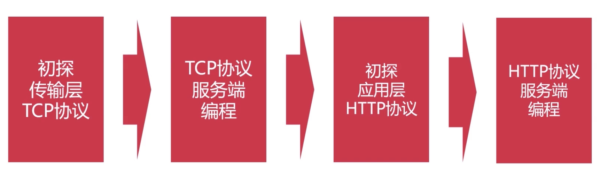
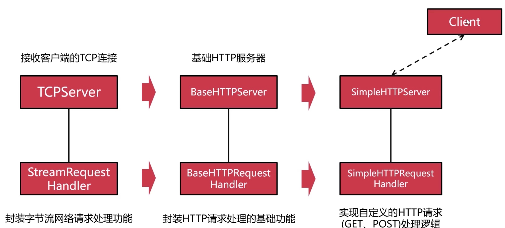
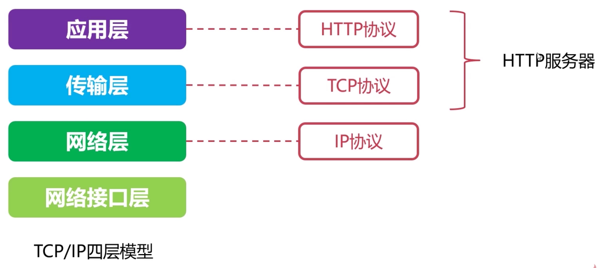
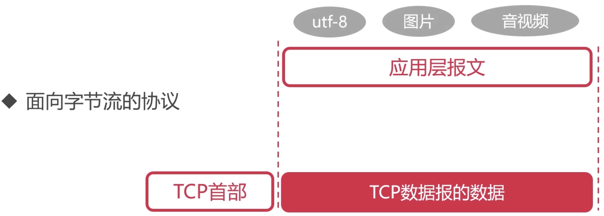
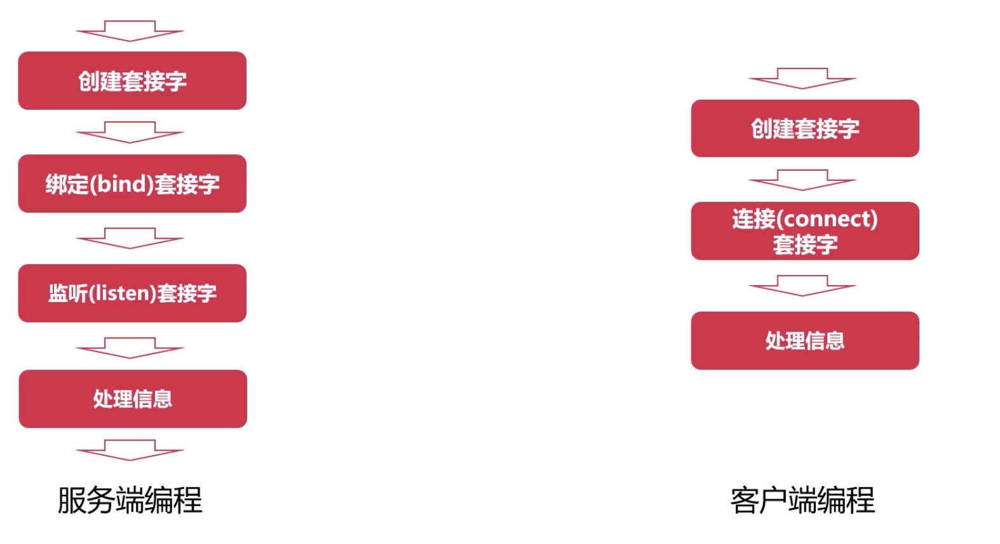
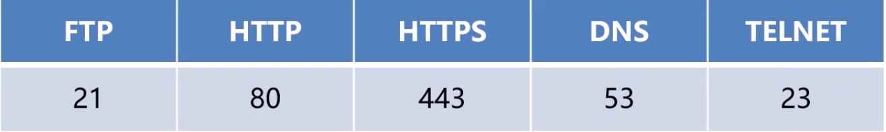

## TCP

### 可靠传输

-   保证数据的准确传输

### 流量控制

-   感知对方压力控制流量
-   如服务器与普通计算机之间进行数据传输，由于网卡性能差异，通过TCP协议可以感知到，服务器会控制流量

### 拥塞控制

-   感知网络压力并控制发送速度，互联网压力

### TCP报文

应用：

-   微信/QQ等消息发送接收
-   浏览器-服务器通信
-   其他可靠通信场景

## 网络套接字与通信过程

-   使用端口(Port)来标记不同的网络进程
-   端口(Port)使用16比特位表示(0 ~ 65535)

### 套接字

-   {IP : Port}  –>  套接字       （计算机IP,   进程Port）
-   套接字（Socket）是抽象概念，表示TCP 链接的一端
-   通过套接字可以进行数据发送或接收

### 实现网络服务器TCPServer类

### 网络请求处理器Handler类

