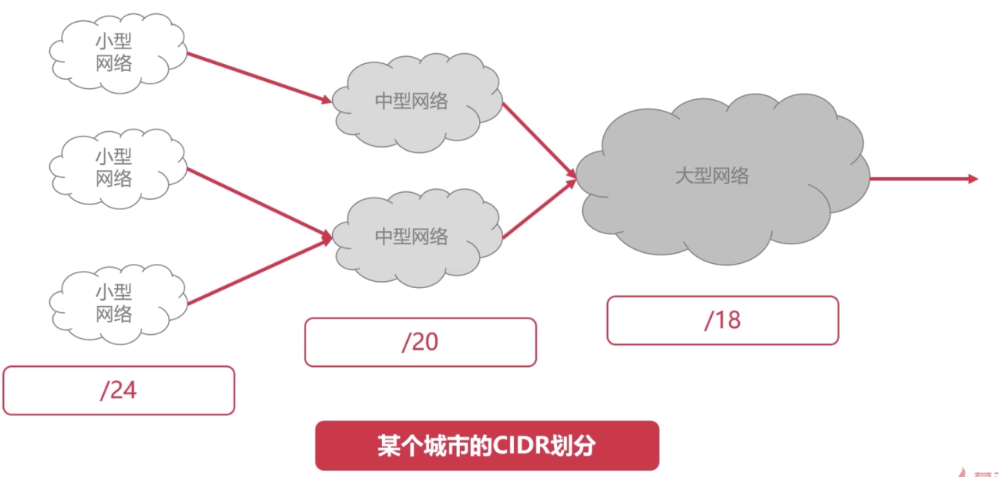

## 什么是计算机网络

>   将一些可以传递信息的硬件通过网络连接起来，所组成的网络
>
>   不仅是软件概念，还包括硬件设备
>
>   不仅是信息通信，支持应用

### 分类

#### 作用范围分

-   广域网（WAN)   方圆几十到几千公里   跨省跨国
-   城域网（MAN)     方圆5千米到50千米   城市间
-   局域网（LAN)       1千米以内的地区内，家庭

#### 使用者分

-   公用网络
-   专用网络

### 计算机的历史

-   第一阶段：单个网络（美国军方）

    通过交换机将多个端系统（主机）相连接

-   第二阶段：三级结构互联网

    树状网络（图）

-   第三阶段：多层次   ISP 互联网

     ISP（Internet Service Provider)  网络服务提供商  （中国电信，中国移动， 中国联通等）

    各个国家地区的ISP彼此连接

    每个ISP（中国移动） 与自身地区ISP（北京移动）相连接

    地区ISP与客户网络相连接（校园，公司，小区等）（图）

    #### 现代互联网的主要线路

    海底电缆

#### 中国互联网的历史

-   1980年互联网实验
-   1989年公共网络
-   1994年接入国际互联网

>   国家级ISP:：中国电信，联通，移动互联网，中国教育与科研计算机网，中国科学技术网

通过这五个网络与世界网络连接，访问外网

## 网络层

### 计算机

基于网卡实现通信

### 中继器

-   在物理层，简单的信号放大器
-   信号在传输中发生衰减，中继器的作用就是将信号放大，使信号传的更远

### 集线器

-   中继器的一种形式，

# 网络层

>   解决了数据路由（决定数据在网络的路径）

解决了A到B传输数据的问题

## IP协议详解

### 虚拟互联网络

-   实际的计算机网络是复杂的
-   物理设备使用IP协议，屏蔽了物理网络之间的差异
-   当网络中的主机使用IP协议连接时，则无需关注网络细节

### IP协议

>   使复杂的实际网络变为一个虚拟互联的网络
>
>   使网络层可以屏蔽底层细节而专注网络层的数据转发
>
>   解决了在虚拟网络中数据包传输路径的问题

#### IP地址

#### IP数据报

>   由IP首部和IP数据报的数据组成

##### IP首部的组成

###### 4位版本

>   占4位，通信双方版本必须一致，当前主流为**IPv4**， 也有**IPv6**

###### 首部位长度

>   占4位，最大数值为15，表示IP首部长度，单位是“32位字”，也即是IP首部最大长度位60字节

###### 总长度

>   占16位，最大数值为65535，表示IP数据报总长度（若超过MTU长度，则会被分片）

###### 标志

>   表示数据报是否可以分片

###### 片偏移

>   记录分片操作时，进行到了第几次分片

###### TTL

>   占8位，表明IP数据报文在网络中的寿命，每经过一个设备，TTL自减一，TTL = 0时，报文被丢弃
>
>   避免数据在网络中被无限传输

###### 协议

>   占8位，表明IP数据所携带的具体数据是什么协议

######  首部校验和

>   占16位，校验IP首部是否有出错

###### 源IP地址，目的IP地址

>   即发送设备的IP,接受设备的IP,都为32位

## IP协议的转发流程

**逐跳hop-by-hop**

>   数据报从一个设备跳到另外一个设备，直到跳到目标设备

### 路由器

#### 路由表

>   计算机或者路由器都拥有路由表
>
>   包含MAC地址和硬件接口，目的IP地址，下一跳IP地址

### IP协议的转发流程

当发生跨数据传输时

**在网络层发生**

>   在网络层，网络链路层发生

>   在每一跳中，

-   数据帧的MAC地址都在变化
-   IP数据报的IP地址始终不变

## ARP协议与RARP协议

ARP地址解析协议

将 **网络层IP32位地址** 转为  **数据链路层MAC48位地址**

### ARP缓存表

>   数据报在设备之间传递时，路由器通过查看ARP缓存表，知道IP地址对应的MAC地址

-   ARP缓存表缓存有IP地址和MAC地址的映射关系
-   ARP缓存表缓存**没有I**P地址和MAC地址的映射关系
-   ARP缓存表是ARP协议和RARP协议运行的关键
-   缓存记录有一定期限
-   查看ARP缓存表的命令行是  arp -a

### RARP协议

与ARP协议相反，为  **逆地址解析协议**

将 **数据链路层MAC48位地址** 转为  **网络层IP32位地址**

## IP地址的子网划分

### 分类的IP地址

由网络号和主机号组成

-   A类地址：8位网络号，24位主机号
-   B类地址：16位网络号，16位主机号
-   C类地址：24位网络号，8位主机号
-   D类地址，E类地址为特殊用途

#### 特殊的主机号

-   主机号全为0表示当前网络段，不可分配为特定主机
-   主机号全为1表示广播地址，向当前所有网络段所有主机发消息

#### 特殊的主机号

-   A类地址网络端全为0表示特殊网络
-   A类地址网络段后7为全为1表示**回环地址**
-   B类地址网络段（10000000.00000000:128.0）是不可使用的
-   C类地址网络段（192.0.0）是不可使用的

#### 判断属于哪类地址

前八位为

-   011  A
-   101  B
-   110  C
-   1110  D
-   1111  E

## 划分子网

**将IP地址分为**

网络号，子网号，主机号

### 子网掩码

**当子网变多时，通过子网掩码来判断**

-   子网掩码和IP地址一样，都是32位
-   子网掩码由连续的1和连续的0组成
-   某个子网的子网掩码具备与网络号位数相同个数的连续的1

## 无分类编址CIDR

-   没有A	B	C类网络号，和子网划分的概念
-   CIDR  将网络前缀相同的IP地址称为一个“CIDR地址块”
-   由     网络前缀    主机号  组成  （网络前缀是任意位数的）

### 斜线记法

193.10.10.129/25           网络前缀为193.10.10.129       主机号为25        

相比原来子网划分更加灵活

#### 城市的CIDR划分

