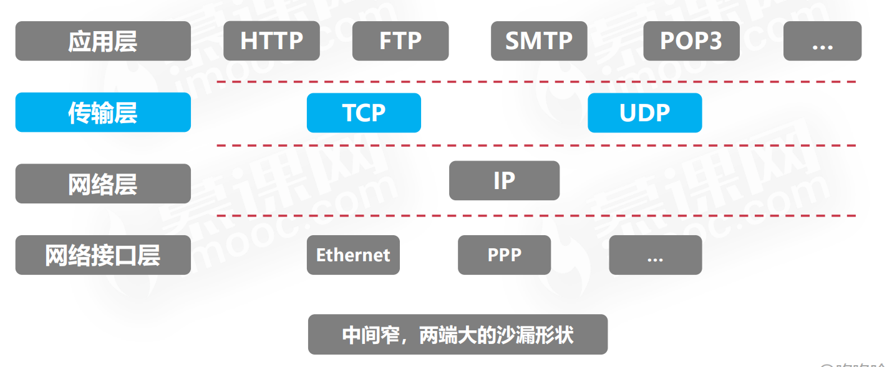

## 一些常见的指标

### 速率

速率即数据率或称数据传输率或比特率

连接在计算机网络上的主机在数字信道上传送数据位数的速率

单位是 `bit/s  kbit/s  Gbit/s Tbit/s`   进率为 10^3

### 带宽

原本指某个信号具有的频带宽度，即最高频率与最低频率之差，单位是赫兹 `Hz`

现在所指，带宽用来表示网络的通信线路**传送数据的能力**，通常是指单位时间内从网络中的某一点到另一点所能通过的“最高数据率”。单位是“比特每秒”，b/s，kb/s，Mb/s，Gb/s

对应网络设备所支持的**最高速度**   发送速率  不是传播速率

```
链路带宽=1Mb/s           主机在1us内可向链路发1bit数据
链路带宽=2Mb/s           主机在1us内可向链路发2bit数据
```

### 吞吐量

表示在单位时间内通过某个网络（或信道、接口）的数据量。单位b/s，kb/s，Mb/s等
吞吐量受网络的带宽或网络的额定速率的限制

链路带宽是吞吐量的上限   吞吐量等于实际通过速率之和   


### 时延

指数据（报文/分组/比特流）从网络（或链路）的一端传送到另一端所需的时间。

也叫延迟或迟延。单位是秒(s)

#### 有四类

`发送，传播，排队，处理时延`

##### 发送时延（传播时延）

从发送分组的第一个比特算起，到分组的最后一个比特发送完毕所需要的时间


##### 传播时延

取决于电磁波传播速度和链路长度


##### 排队时延

等待输出/输入链路可用    处理前的排队等待

##### 处理时延

设备对数据进行处理，检错，路径匹配

#### 时延减少

一般通过减少发送时延来较少总时延   提高信道的带宽（发送速率）

#### 时延带宽积

`时延带宽积(bit) = 传播时延(s) X 带宽(bit/s)`

信道上的数据量   

时延带宽积又称为以比特为单位的链路长度。
即“某段链路现在有多少比特”    也也作为链路的长度

#### 往返时延RTT

从发送方发送数据开始，到发送方收到接收方的确认（接收方收到数据后立即发送确认），总共经历的时延


RTT越大，在收到确定之前，可以发送的数据越多

**RTT = 传播时延*2 + 末端处理时间**

### 利用率

*   信道利用率
*   网络利用率


时延(D) 与 利用率U 的关系图


利用率越高，代表链路中的比特越多，越拥挤

### 分层结构

#### 为什么要分层

发送文件前要完成的工作：做发送前的准备
（1）发起通信的计算机必须将数据通信的通路进行激活。
（2）要告诉网络如何识别目的主机。
（3）发起通信的计算机要查明目的主机是否开机，并且与网络连接正常。
（4）发起通信的计算机要弄清楚，对方计算机中文件管理程序是否已经做好准备工作。
（5）确保差错和意外可以解决。

#### 分层的基本原则

1.各层之间相互独立，每层只实现一种相对独立的功能
2.每层之间界面自然清晰，易于理解，相互交流尽可能少
3.结构上可分割开。每层都采用最合适的技术来实现
4.保持下层对上层的独立性，上层单向使用下层提供的服务
5.整个分层结构应该能促进标准化工作

#### 认识分层结构

三大要素：**协议， 服务， 接口**

1.  实体：第n层中的活动元素称为n层实体。同一层的实体叫对等实体。

2.  协议：为进行网络中的对等实体数据交换而建立的规则、标准或约定称为网络协议。【水平】

*   语法：规定传输数据的格式
*   语义：规定所要完成的功能
*   同步：规定各种操作的顺序

3.  接口（访问服务点SAP）：上层使用下层服务的入口。
4.  服务：下层为相邻上层提供的功能调用。【垂直】

每一层对数据进行处理包装

SDU服务数据单元：为完成用户所要求的功能而应传送的数据。
PCI协议控制信息：控制协议操作的信息。
PDU协议数据单元：对等层次之间传送的数据单位。

*   从应用层开始，传输数据 **SDU** 

*   然后向下进入传输层    进行**PCI** 操作信息的包装   PCI + SDU = PDU    PDU作为数据再进入网络层，以此类推   

*   通过链路层发送    在接收端的链路层接收   再向上层传输数据   解开包装 到达应用层

#### 分层结构总结

*   网络体系结构是从**功能**上描述计算机网络结构
*   计算机网络体系结构简称网络体系结构是**分层结构**
*   每层遵循某个/些**网络协议**以完成本层功能
*   **计算机网络体系结构**是计算机网络的**各层及其协议**的集合
*   第n层在向n+1层提供服务时，此服务不仅包含第n层本身的功能，还包含由下层服务提供的功能
*   仅仅在**相邻层间有接口**，且所提供服务的具体实现细节对上一层完全屏蔽
*   体系结构是**抽象**的，而实现是指能运行的一些软件和硬件


## @1.4 参考模型

### OSI参考模型(开放系统互连参考模型)

网络七层协议

*   在需要一个不同抽象体的地方创建一层

*   每一层都应该执行一个明确定义的功能

*   每一层功能的选择应该向定义国际标准化协议的目标看齐

*   层与层边界的选择应该使跨越接口的信息流最小

*   层数应该足够多，保证不同的功能不会被混杂在同一层中，但同时层数又不能太多，以免体系结构变得过于庞大

| 七层协议   | 主要任务                               | 协议列举                                   |
| ---------- | -------------------------------------- | ------------------------------------------ |
| 应用层     | 文件传输，电子邮件，文件服务，虚拟终端 | TFTP,`HTTP`,SNMP,`FTP`,SMTP,`DNS`,`Telnet` |
| 表示层     | 数据格式化，代码转换，数据解密         |                                            |
| 会话层     | 解除或建立与其他接点的联系             |                                            |
| 传输层     | 提供端对端的接口                       | `TCP`,`UDP`                                |
| 网络层     | 为数据包选择路由                       | `IP`,ICMP,RIP,OSPF,BGP,IGMP                |
| 数据链路层 | 传输有地址的帧，错误检测功能           | SLIP,CSLIP,PPP,`ARP`,RARP,MTU              |
| 物理层     | 以二进制数据形式在物理媒体上传输数据   | ISO2110,IEEE802                            |


#### 物理层

物理层（physical layer）关注在一条通信信道上传输原始比特。设计问题必须确保当一方发送了比特1时，另一方收到的也是比特1，而不是比特0。这里的典型问题包括用什么电子信号来表示1和0、一个比特持续多少纳秒、传输是否可以在两个方向上同时进行、初始连接如何建立、当双方结束之后如何撤销连接、网络连接器有多少针以及每一针的用途是什么等。这些设计问题主要涉及机械、电子和时序接口，以及物理层之下的物理传输介质等。

#### 数据链路层

数据链路层（data link layer）的主要任务是将一个原始的传输设施转变成一条没有漏检传输错误的线路   数据链路层完成这项任务的做法是将真实的错误掩盖起来，使得网络层看不到。为此，发送方将输入的数据拆分成数据帧（data frame），然后顺序发送这些数据帧。一个数据帧通常为几百个或者几千个字节长。如果服务是可靠的，则接收方必须确认正确收到的每一帧，即给发送方发回一个确认帧（acknowledgement frame）。
数据链路层（和大多数高层都存在）的另一个问题是如何避免一个快速发送方用数据
“淹没”一个慢速接收方。所以，往往需要一种流量调节机制，以便让发送方知道接收方何时可以接收更多的数据
广播式网络的数据链路层还有另一个问题：如何控制对共享信道的访问。数据链路层的一个特殊子层，即介质访问控制子层，就是专门处理这个问题的。

#### 网络层

网络层（network layer）的主要功能是控制子网的运行。一个关键的设计问题是如何将数据包从源端路由到接收方。路由可以建立在静态表的基础上，这些表相当于网络内部的“布线”，而且很少会改变；或者，更常见的情况是路由可以自动更新，以此来避免网络中的故障组件。路由也可以在每次会话（例如一次终端会话）开始时就确定下，·论登录到一台远程机器上。最后，路由可以是高度动态的，针对每一个数据包都重新确定路径，以便反映网络当前的负载情况。
如果有太多的数据包同时出现在一个子网中，那么这些数据包彼此之间会相互阻碍，从而形成传输瓶颈。处理拥塞也是网络层的责任，一般要和高层协议结合起来综合处理拥塞才有效，高层协议必须适应它们注入网络中的负载。更普遍的是网络所提供的服务质量（延迟、传输时间、抖动等）也是网络层的问题。
当一个数据包必须从一个网络传输到另一个网络才能够到达它的目的地时，可能会发生很多问题。比如，第二个网络所使用的寻址方案可能与第一个网络不同；第二个网络可能无法接受这个数据包，因为它太大了；两个网络所使用的协议也可能不一样，等等。网络层应该解决所有这些问题，从而允许异构网络相互连接成为互联网络。
在广播式网络中，路由问题比较简单，所以网络层往往比较单薄，甚至根本不存在。

#### 传输层

传输层（transport layer）的基本功能是接收来自上一层的数据，在必要的时候把这些数据分割成较小的单元，然后把这些数据单元传递给网络层，并且确保这些数据单元正确地到达另一端。而且，所有这些工作都必须高效率同时以一种上下隔离的方式完成，即随着时间的推移导致底层硬件技术不可避免地发生改变时，对上面各层是透明的。                                                                                                                                                         传输层还决定了向会话层，因而是实际的最终网络用户提供哪种类型的服务。其中最为常见的传输连接是一个完全无错的点到点信道，此信道按照原始发送的顺序来传输报文或者字节数据。然而，其他类型的传输服务也有可能，例如传输独立的报文但不保证传送的顺序、将报文广播给多个目标节点等。服务的类型是在建立连接时就确定下来的（顺便说一下，完全无错的信道是不可能实现的；人们使用这个术语的真正含义是指出错率很低，小到足以忽略掉）。
传输层是真正的端到端的层，它自始至终将数据从源端携带到接收方。换句话说，源机器上的一个程序利用报文头和控制信息与目标机器上的一个类似程序进行会话。在其下面的各层，每个协议涉及一台机器与它的直接邻居，而不涉及最终的源机器和目标机器，即源机器和目标机器可能被多个中间路由器隔离了。第1~3层是链式连接的，而第4～7层是端到端的，两者之间的区别如图1-20所示。
会话层
会话层（session layer）允许不同机器上的用户建立会话。会话通常提供各种服务，包括对话控制（dialog control）（记录该由谁来传递数据）、令牌管理（token management）（禁止双方同时执行同一个关键操作），以及同步功能（synchronization）（在一个长传输过程中设置一些断点，以便在系统崩溃之后还能恢复到崩溃前的状态继续运行）。

#### 表示层

表示层以下的各层最关注的是如何传递数据位，而表示层（presentation layer）关注的是所传递信息的语法和语义。不同的计算机可能有不同的内部数据表示法，为了让这些计算机能够进行通信，它们所交换的数据结构必须以一种抽象的方式来定义，同时还应该定义一种“线上”使用的标准编码方法。表示层管理这些抽象的数据结构，并允许定义和交换更高层的数据结构（比如银行账户记录）。

#### 应用层

应用层（application layer）包含了用户通常需要的各种各样的协议。一个得到广泛使用的应用协议是超文本传输协议（HTTP，Hyper Text Transfer Protocol），它是万维网（WWW，World Wide Web）的基础。当浏览器需要一个Web页面时，它通过HTTP.将所要页面的名字发送给服务器，然后服务器将页面发回给浏览器。其他一些应用协议可用于文件传输、电子邮件以及网络新闻等。


### TCP/IP模型




### 两个模型的主要不同

**OSI是一个理论上的网络通信模型，而TCP/IP则是实际运行的网络协议**

本书采用的混合模型：物理层   数据链路层  网络层   传输层  应用层

这个模型有5层

从物理层往上穿过数据链路层、网络层和传输层到应用层。

**物理层**规定了如何在不同的介质上以电气（或其他模拟）信号传输比特。

**链路层**关注的是如何在两台直接相连的计算机之间发送有限长度的消息，并具有指定级别的可靠性。以太网和802.11是链路层协议的例子。

**网络层**主要处理如何把多条链路结合到网络中，以及如何把网络与网络联结成互联网络，以便使我们可以在两个相隔遥远的计算机之间发送数据包。网络层的任务包括找到传递数据包所走的路径。IP是我们将要学习的网络层主要协议案例。

**传输层**增强了网络层的传递保证，通常具有更高的可靠性，而且提供了数据交付的抽象，比如满足不同应用需求的可靠字节流。TCP是传输层协议的一个重要实例。

**应用层**包含了使用网络的应用程序。许多网络应用程序都有用户界面，比如Web浏览器，但也不是所有的应用程序都有用户界面。然而，我们关心的是应用程序中使用网络的那部分程序。在Web浏览器的情况下就是HTTP协议。应用层也有重要的支撑程序供许多其他应用程序使用，比如DNS


## @@1.5 网络实例

### 因特网

因特网（Internet）并不是单个网络，而是大量不同网络的集合，这些网络使用特定的公共协议，并提供特定的公共服务。Internet是一个不同寻常的系统，它不是由任何人规划出来的，也不受任何人控制。

#### ARPANET


#### NSFNET


#### Internet的体系结构

Internet网络体系结构**以TCP/IP协议为核心**。其中IP协议用来给各种不同的通信子网或局域网提供一个统一的互连平台，TCP协议则用来为应用程序提供端到端的通信和控制功能。Internet并不是一个实际的物理网络或独立的计算机网络，它是世界上各种使用统一TCP/IP协议的网络的互连。Internet已是一个在全球范围内急剧发展、且占主导地位的计算机互连网络

**网络协议**是计算机网络必不可少的，一个完整的计算机网络需要有一套复杂的协议集合，组织复杂的计算机网络协议的最好方式就是层次模型。而将计算机网络层次模型和各层协议的集合定义为计算机网络体系结构(Network Architecture)

计算机网络由**多个互连的结点**组成，结点之间要不断地交换数据和控制信息，要做到有条不紊地交换数据，每个结点就必须遵守一整套合理而严谨的结构化管理体系·计算机网络就是按照高度采用功能分层原理来实现的，即计算机网络体系结构的内容

通常所说的计算机网络体系结构，即在世界范围内统一协议，制定软件标准和硬件标准，并将计算机网络及其部件所应完成的功能精确定义，从而使不同的计算机能够在相同功能中进行信息对接


### 第三代移动电话网络

第一代通讯是指模拟信号手机；第二代通讯是指数位讯号手机，如我们常见的GSM，提供低速率数据服务；2.5G是指在第二代手机上提供中等速率的数据服务，如GPRS，传输率一般在几十至一百多kbps。

3G能将无线通信与国际互联网等多媒体通信结合的新一代移动通信系统。能够处理图像、音乐、视讯形式，提供网页浏览、电话会议、电子商务信息服务。无线网络必须能够支援不同的数据传输速度，也就是说在室内、室外和行车的环境中能够分别支持至少2Mbps、384kbps以及144kbps的传输速度。由于采用了更高的频带和更先进的无线（空中接口）接入技术，3G标准的流动通信网络通信质素较2G、2.5G网络有了很大提高，比如软切换技术使得旅途中高速运动的移动用户在驶出一个无线小区并进入另一个无线小区时不再出现掉话现象。而更高的频带范围和 用户分级规则使得单位区域内的网络容量大大提高，同时通话允许量大大增加


### 无线局域网：802.11

所谓的IEEE802.11无线局域网就是指基于IEEE802.11标准的无线局域网。IEEE802.11是美国电机电子工程师协会（IEEE）为解决无线网路设备互连，于**1997年6月**制定发布的无线局域网标准。

802.11是IEEE制订的第一个无线局域网标准，主要用于解决办公室局域网和校园网中用户与用户终端的无线接入，业务主要限于数据访问，速率最高只能达到2Mbit/s。由于它在速率和传输距离上都不能满足人们的需要，因此，IEEE小组又相继推出了802.11b和802.11a两个新标准，前者已经成为目前的主流标准，而后者也被很多厂商看好