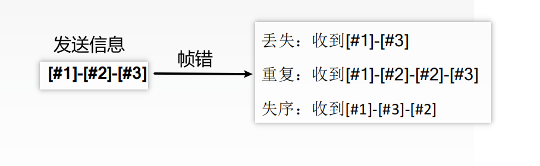
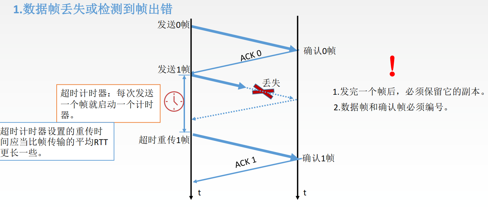
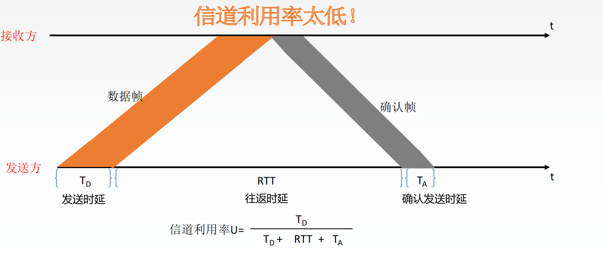
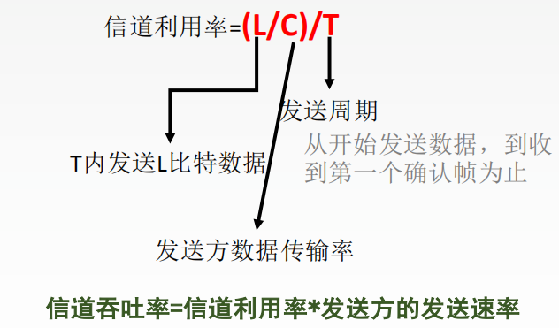

## @数据链路层的设计问题

**基本概念**

结点：主机、路由器

链路：网络中两个结点之间的物理通道，链路的传输介质主要有双绞线、光纤和微波。分为有线链路、无线链路

数据链路：网络中两个结点之间的逻辑通道，把实现控制数据传输协议的硬件和软件加到链路上就构成数据链路

帧：链路层的协议数据单元，封装网络层数据报

**主要任务**：负责通过一条链路从一个结点向另一个物理链路直接相连的相邻结点传送数据报

**主要功能**

数据链路层在物理层提供服务的基础上**向网络层提供服务**，其最基本的服务是**将源自网络层来的数据可靠地传输到相邻节点的目标机网络层**。其主要作用是**加强物理层传输原始比特流的功能**，将物理层提供的可能出错的物理连接改造成为**逻辑上无差错的数据链路**，使之对网络层表现为一条无差错的链路


*   为网络层提供服务。无确认无连接服务，有确认无连接服务，有确认面向连接服务。**有连接一定有确认！**
*   链路管理，即连接的建立、维持、释放（用于面向连接的服务）
*   组帧
*   流量控制。限制发送方
*   差错控制（帧错/位错）

通信质量好有线传输链路

通信质量差的无线传输链路


**封装成帧与透明传输**

**封装成帧**

**发送端**将网络层的**IP数据报**进行包装，封装成帧，添加帧首部与帧尾部

**接收端**在收到物理层上交的比特流后，就能根据首部和尾部的标记，从收到的比特流中识别帧的开始和结束

首部和尾部包含许多的控制信息，他们的一个重要作用：**帧定界**（确定帧的界限）

**帧同步**：接收方应当能从接收到的二进制比特流中区分出帧的起始和终止

组帧的四种方法：1.字符计数法，2.字符（节）填充法，3.零比特填充法，4.违规编码法。


**1.字符计数法**


2.**字符填充法**


含有特殊字符的处理方法


3.**零比特填充法**


4.违规编码法


由于字节计数法中Count字段的脆弱性（其值若有差错将导致灾难性后果）及字符填充实现上的复杂性和不兼容性，**目前较普遍使用的帧同步法是   两个比特填充法和违规编码法**


**透明传输**

透明传输是指不管所传数据是什么样的比特组合，都应当能够在链路上传送。因此，链路层就“看不见”有什么妨碍数据传输的东西

当所传数据中的比特组合恰巧与某一个控制信息完全一样时，就必须采取适当的措施，使收方不会将这样的数据误认为是某种控制信息。这样才能保证数据链路层的传输是透明的。


## @差错检测和纠正

### 差错控制（检错编码）

>   传输中的差错都是由于噪声引起的

全局性：由于线路本身电气特性所产生的随机噪声（热噪声），**是信道固有的**，随机存在的。
				解决办法：提高**信噪比**来减少或避免干扰。（对传感器下手）

局部性：外界特定的短暂原因所造成的冲击噪声，是产生差错的主要原因
				解决办法：通常利用**编码技术**来解决

**需要注意的是**

这里的编码与物理层的编码有很大不同

>   数据链路层编码和物理层的数据编码与调制不同。**物理层编码针对的是单个比特**，解决传输过程中比特的同步等问题，如曼彻斯特编码。而**数据链路层的编码针对的是一组比特**，它通过冗余码的技术实现一组二进制比特串在传输过程是否出现了差错


#### **差错类型**

##### **位错**

比特位出错，1变成0，0变成1

解决方法：


##### **其中的循环冗余码**

>   在数据发送之前，先按某种关系附加上一定的冗余位，构成一个符合某一规则的码字后再发送。当要发送的有效数据变化时，相应的冗余位也随之变化，使码字遵从不变的规则。接收端根据收到码字是否仍符合原规则，从而判断是否出错

##### 帧错




##### **奇偶校验码**


若发生偶数个错误时，会无法检测出

只能检查出奇数个比特错误，检错能力为50%

**CRC循环冗余码**

检错方式


例题

要发送的数据是`1101011011`，采用CRC校验，生成多项式是`10011`，那么最终发送的数据应该是？


先将 源数据 / 生成多项式       用余数与源数据相加    得到最终发送的数据为 `11010110111110`

##### **接收方检错过程**

把收到的每一个帧都除以同样的除数，然后检查得到的余数R

1.余数为0，判定这个帧没有差错，接受。
2.余数为不为0，判定这个帧有差错（无法确定到位），丢弃

FCS的生成以及接收端CRC检验都是由硬件实现，处理很迅速，因此不会延误数据的传输


##### **纠错编码---海明码**

海明码：发现双比特错，纠正单比特错

动一发而牵全身

过程： 确定校验码位数r  --->  确定校验码和数据的位置 --->   求出校验码的值   ----->    检错并纠错

**确定校验码位数r**


**确定校验码和数据的位置**


**求出校验码的值**


结果为

```
故  101101  的海明码为  0010011101
```

**检错并纠错**


二进制序列为0101，恰好对应十进制5，这样就找到了出错的位置，即出错位是第5位


## @流量控制

>   较高的发送速度和较低的接收能力的不匹配，会造成传输出错，因此流量控制也是数据链路层的一项重要工作

数据链路层的流量控制是点对点的，而传输层的流量控制是端到端的

数据链路层流量控制手段：接收方收不下就不回复确认。传输层流量控制手段：接收端给发送端一个窗口公告

### 流量控制的方法

**停止-等待协议** 相对低效

每发送完一个帧就停止发送，等待对方的确认，在收到确认后再发送下一个帧


**滑动窗口协议**  相对高效

*   后退N帧协议 GBN
*   选择重传协议 SR

发送窗口与接收窗口不断移动


*   停止-等待协议        发送窗口大小=1，接收窗口大小=1

*   后退N帧协议（GBN）发送窗口大小1，接收窗口大小=1

*   选择重传协议（SB）发送窗口大小1，接收窗口大小1


## @基本数据链路层协议

### 停止---等待协议

>   除了比特出差错，底层信道还会出现丢包问题
>   为了实现流量控制

虽然现在常用全双工通信方式，但为了讨论问题方便，仅考虑一方发送数据（发送方），一方接收数据（接收方）
因为是在讨论可靠传输的原理，所以并不考虑数据是在哪一个层次上传送的
“停止-等待”就是每发送完一个分组就停止发送，等待对方确认，在收到确认后再发送下一个分组


#### 无差错情况&有差错情况

**有差错情况**




#### 性能分析




#### 信道利用率

>   发送方在一个发送周期内，有效地发送数据所需要的时间占整个发送周期的比率



**例题：**

一个信道的数据传输率为4kb/s，单向传播时延为30ms，如果使停止-等待协议的信道最大利用率达到80%，要求的数据帧长度至少为多少？


### 选择重传协议


停等协议存在一定弊端：通过累计确认导致了批量重传

而选择重传协议解决了这个问题：设置单个确认，同时加大接收窗口，设置接收缓存，缓存乱序到达的帧


#### 作为发送方需要做的三件事

**1.上层的调用**

从上层收到数据后，SR发送方检查下一个可用于该帧的序号，如果序号位于发送窗口内，则发送数据帧；否则就像GBN一样，要么将数据缓存，要么返回给上层之后再传输

**2.收到了一个ACK**（确认帧）

如果收到ACK，加入该帧序号在窗口内，则SR发送方将那个被确认的帧标记为已接收。如果该帧序号是窗口的下界（最左边第一个窗口对应的序号），则窗口向前移动到具有最小序号的未确认帧处。如果窗口移动了并且有序号在窗口内的未发送帧，则发送这些帧。


**3.超时事件**

每个帧都有自己的定时器，一个超时事件发生后只重传一个帧

#### 作为接收方需要做的三件事

**来者不拒（窗口内的帧）**

接收方将确认一个正确接收的帧而**不管其是否按序**。失序的帧将被**缓存**，并返回给发送方一个该帧的确认帧【收谁确认谁】，直到所有帧（即序号更小的帧）皆被收到为止，这时才可以将一批帧按序交付给上层，然后**向前移动滑动窗口**


如果收到了窗口序号外（小于窗口下界）的帧，就返回一个ACK
其他情况，就忽略该帧

**运行中的SR**


#### 滑动窗口长度

发送窗口最好等于接收窗口。（大了会溢出，小了没意义）


例子


#### 协议重点

*   对数据帧逐一确认重传

*   只重传错帧

*   接收方有缓存

*   ```
    发送窗口  =  接收窗口  = 2^(n-1)
    ```

**习题**

数据链路层采用了选择重传（SR）协议，发送方已经发送了编号为0~3的帧。现已收到1号帧的确认，而0、
2号帧依次超时，则发送方需要重传的帧数是（ ）

解析：

>   1号帧已经确认，无需重传
>
>   3号帧未知，可能在路上，或者是已经确认
>
>   只有0，2号帧超时
>
>   所以答案为2     需要重新发送0，2号帧


@滑动窗口协议


@@数据链路协议实例