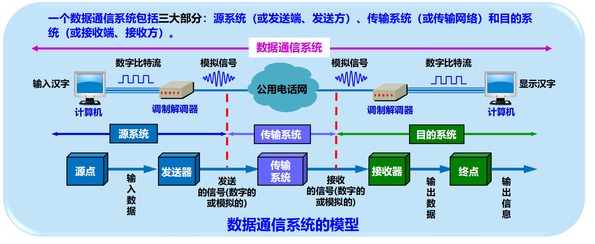
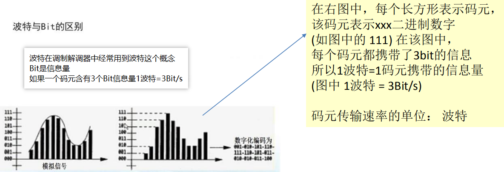
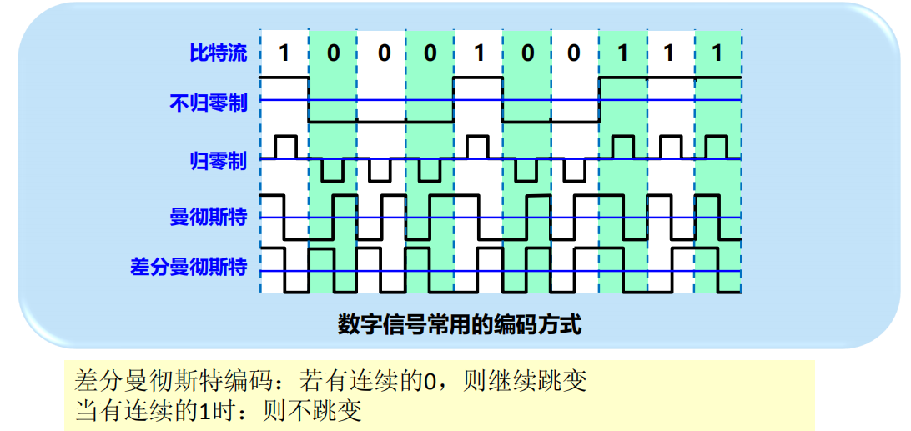
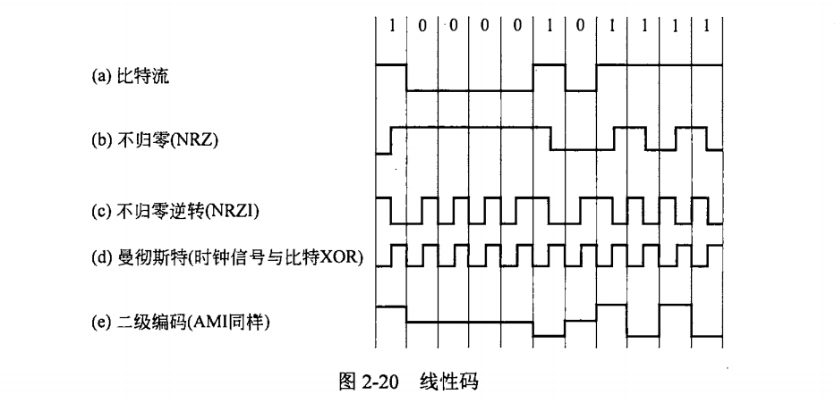

# 物理层

*   物理层考虑的是怎样才能在连接各种计算机的传输媒体上传输数据比特流，而不是指具体的传输媒体

*   物理层的作用是要尽可能地屏蔽掉不同传输媒体和通信手段的差异

*   用于物理层的协议也常称为物理层规程（procedure）
*   物理层与具体的传输媒介无关

主要任务: 确定与传输媒体的接口的一些特性

*   机械特性：指明接口所用接线器的形状和尺寸、引线数目和排列、固定和锁定装置等

*   电气特性：指明在接口电缆的各条线上出现的电压的范围

*   功能特性：指明某条线上出现的某一电平的电压的意义

*   过程特性：指明对于不同功能的各种可能事件的出现顺序

## @数据通信系统的模型

#### 实验机房中PC之间的通信方式

PC通过交换机连接而组成计算机网络不通过调制解调器和公用电话网直接是数字信号-->数字信号的传输   通过交换机组件的计算机网络不具有代表性，所以上述的模型是典型的数据通信模型

#### 常用术语

*   数据（data）——运送消息的实体（消息赋予数据语义，类似于信息与数据）

*   信号（signal）——数据的电气的或电磁的表现

*   模拟信号（analogous signal）——代表消息的参数的取值是连续的

*   数字信号（digital signal）——代表消息的参数的取值是离散的

*   码元（code）——在使用时间域（或简称为时域）的波形表示数字信号时，代表不同离散数值的基本波形

使用双绞线传输，信号表示的是电压的高低使用光纤传输，信号表示的是光信号数据可以用这些信号来表现

#### 码元

*   在数字通信中常常用时间间隔相同的符号来表示一个二进制数字

*   这样的时间间隔内的信号称为二进制码元。而这个间隔被称为码元长度

*   1码元可以携带nbit的信息量

#### 信道

一般用来表示向某一个方向传送信息的媒体
（平常说的通信线路往往包含一条发送信息的通道和一条接收信息的信道）

*   单向通信（单工通信）——只能有一个方向的通信而没有反方向的交互

*   双向交替通信（半双工通信）——通信的双方都可以发送信息，但不能双方同时发送（当然也就不能同时接收）
*   双向同时通信（全双工通信）——通信的双方可以同时发送和接收信息

##### 基带信号

（即基本频带信号）——来自信源的信号。像计算机输出的代表各种文字或图像文件的数据信号都属于基带信号
基带信号往往包含有较多的低频成分，甚至有直流成分，而许多信道并不能传输这种低频分量或直流分量。因此必须对基带信号进行调制（modulation）

#### 调制分为两大类

*   基带调制：仅对基带信号的波形进行变换，使它能够与信道特性相适应。变换后的信号仍然是基带信号。把这种过程称为编码（coding）

*   带通调制：使用载波（carrier）进行调制，把基带信号的频率范围搬移到较高的频段，并转换为模拟信号，这样就能够更好地在模拟信道中传输（即仅在一段频率范围内能够通过信道）。
*   带通信号：经过载波调制后的信号

#### 常用的编码方式

*   不归零制：正电平代表1，负电平代表-1

*   归零制：正脉冲代表1，负脉冲代表0

*   曼彻斯特编码：位周期中心的向上跳变代表0，位周期中心的向下跳变代表1。但也可反过来定义

*   差分曼彻斯特编码：在每一位的中心处始终都有跳变。位开始边界有跳变代表0，而位开始边界没有跳变代表1

#### 信道的最大数据速率

尼奎斯特证明，如果一个任意信号通过了一个带宽为B的低通滤波器，那么只要进行每秒2B次（确切）采样，就可以完全重构出被过滤的信号。由于通过样值能恢复出来的高频成分已经被滤掉了，所以高于每秒2B次的采样毫无意义。如果信号包含了V个离散等级，则尼奎斯特的定理为：

$$
最大数据速率=2B log_2V（比特/秒）
$$
例如，无噪声的3kHz信道不可能以超过6000bps的速率传输二进制（即只有两级的）信号。

到现在为止，我们只考虑了无噪声信道。如果存在随机噪声，情况会急剧地恶化。并且，由于系统中分子的运动，随机（热）噪声总是存在的。热噪声的数量可以用信号功率与噪声功率的比值来度量，这样的比值称为**信噪比**

如果我们将信号功率记作S，噪声功率记作N，则信噪比为S/N。通常情况下为了适用很大的范围，该比率表示成对数形式10log10S/N，对数的取值单位称为**分贝**

`deci`意味着10，而选择bel则是为了向发明了电话的贝尔致敬。10的信噪比为10分贝，100的信噪比为20分贝，1000的信噪比为30分贝，等等

香农的重大成果是：对于一条带宽为B Hz、噪声比是S/N的有噪声信道，其最大数据速率或者容量（capacity）是

这结论告诉了我们**实际信道能获得的最大容量**

例如，在普通电话线上提供访问Internet的ADSL使用了大约1MHz的带宽。**线路上信噪比的程度取决于住宅和电话交换局之间的距离**，对于1~2千米的短距离来说40分贝的信噪比算是很好的状况了。正是因为电话线具有这样的特性，因此无论采用多少个信号等级，也不管采样频率多快或多慢，永远也不可能在该信道上获得高于13Mbps的数据率。实际上，ADSL的最高速率为12Mbps，虽然用户通常看到的速率要比这低得多。这个数据率实际上已经很好了，通信技术60多年的发展已经极大地缩小了香农容量与实际系统容量之间的沟壑

## @@通讯卫星

地球同步卫星

中地球轨道卫星

低地球轨道卫星

卫星与光纤

## @数字调制与多路复用

有线和无线信道运载模拟信号，模拟信号可表示成诸如连续变化的电压、光照强度或声音强度。为了发送数字信息，我们必须设法用模拟信号来表示比特。**比特与代表它们的信号之间的转换过程称为数字调制**

信道通常被多个信号共享。毕竟，用单根线缆传送几个信号比为每个信号铺设一根线缆要便利得多。这种信道的共享形式称为多路复用技术

### 基带传输

数字调制的最直接形式是用正电压表示1，用负电压表示0。对光纤而言，可用光的存在表示1，没有光表示0。这种编码方案称为**不归零**

一旦**NRZ信号**被发出去，它就沿线缆传播。在线缆的另一端，接收器以一定周期对信号采样，然后把采样信号转换成比特。接收到的信号看上去与发出来的不完全一样，这是因为信道本身造成的信号衰减和信号失真，以及接收器噪声对接收信号造成的影响所致。为了从信号中解码出比特，接收器把信号样值映射到最接近的符号。对于NRZ来说，接收到正电压表示发送过来的是1，接收到负电压表示发送过来的是0

