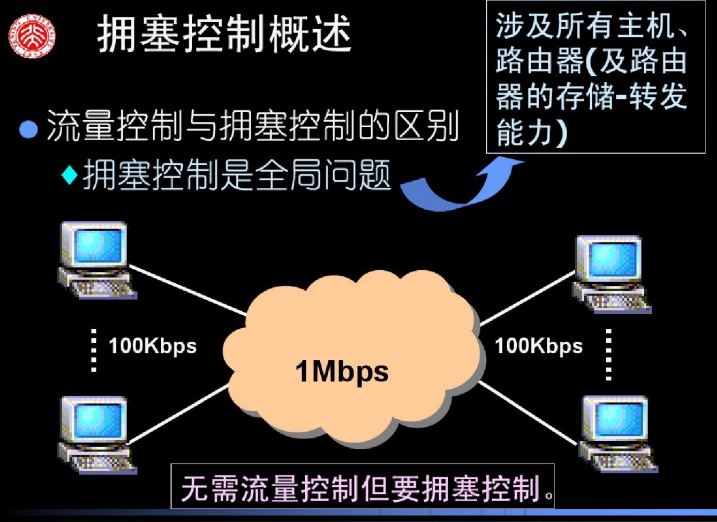

## @网络层的设计问题

>   主要任务是把分组从源端传到目的端，为分组交换网上的不同主机提供通信服务。
>   网络层传输单位是数据报

功能

*   路由选择与分组转发最佳路径
*   异构网络互联
*   拥塞控制

若所有结点都来不及接受分组，而要丢弃大量分组的话，网络就处于拥塞状态。因此要采取一定措施，缓解这种拥塞

### 路由器

>   路由器是一种具有多个输入端口和多个输出端口的专用计算机，其任务是转发分组。

#### 路由表与转发

#### 三层设备的区别

**路由器**可以互联两个不同网络层协议的网段

**网桥**可以互联两个物理层和链路层不同的网段

**集线器**不能互联两个物理层不同的网段

### 数据交换方式

通过路由器将互联网络连接在一起

##### 电路交换  

建立连接(呼叫/电路建立) ---->   通信    ----->   释放连接(拆除电路)

优点：通信时延小   有序传输   没有冲突   实时性强   

特点：独占资源

缺点：建立连接时间长   线路独占，使用效率低  灵活性差  无差错控制能力

##### 报文交换

>   报文：源应用发送的信息媒体

路径不固定   与当时的网络情况有关

优点：无需建立连接  存储转发，动态分配线路   线路可靠性高  线路利用率高  多目标服务

缺点：存储转发时延   报文大小不定，需要网络节点有较大的缓存空间

##### 分组交换

**为因特网的交换方式**，也最常见

>   分组：把大的数据块分割成小的数据块

优点：无需建立连接   存储转发，动态分配线路   线路可靠性高  较比于报文交换，存储管理更容易

缺点：存储转发时延  需要传输额外的信息量  乱序到目的主机时，要对分组排序重组

**例题**

**报文交换需要时间：**

发送：10000bit / 1000 = 10s   需要经过两个设备  所以为 30s

**分组交换需要时间：**

因为分组交换可以依次发送  不需要等待前一分组到达目的主机

时间 = 10000bit / 1000 + 10 / 1000 X 2 = 10.02s

**计算题需要注意的是**

*   单位换算
*   是否考虑延迟
*   时间至少是多少-----选择最少跳数
*   起始时间（从发送开始到接收完为止/从发送开始到发送完毕）
*   是否有分组头部大小的开销
*   报文交换时延更长，分组交换时延可能不是整数

#### 三种数据交换方式总结

*   报文交换和分组交换都采用存储转发
*   传送数据量大，且传送时间远大于呼叫时，选择电路交换。电路交换传输时延最小
*   从信道利用率看，报文和分组交换优于电路交换，其中分组交换时延更小

### 数据报方式&虚电路方式

#### 数据报方式

数据报方式为网络层提供无连接服务

每个分组携带源和目的地址

路由器根据分组的目的地址转发分组：基于路由协议/算法构建**转发表**：检索转发表；每个分组独立选路

无连接服务：不事先为分组的传输确定传输路径，每个分组独立确定传输路径，不同分组传输路径可能不同

#### 虚电路

虚电路方式为网络层提供连接服务

连接服务：首先为分组的传输确定传输路径（建立连接），然后沿该路径（连接）传输系列分组，系列分组传输路径相同，传输结束后拆除连接

虚电路将数据报方式和电路交换方式结合，以发挥两者优点

虚电路：一条源主机到目的主机类似于电路的路径（逻辑连接），路径上所有结点都要维持这条虚电路的建立，都维持一张**虚电路表**，每一项记录了一个打开的虚电路的信息

**建立连接（虚电路建立） ----->   数据传输（全双工通信）------>  释放连接（虚电路释放）**

*   发送的每个分组都携带虚电路号，而非目的地址
*   源主机发送“呼叫请求”分组并收到“呼叫应答”分组后才算建立连接
*   源主机发送“释放请求”分组以拆除电路

### 几种传输单元名词辨析

| 所在层数   | 传输单元名词   |
| ---------- | -------------- |
| 应用层     | 报文           |
| 传输层     | 报文段         |
| 网络层     | IP数据报，分组 |
| 数据链路层 | 帧             |
| 物理层     | 比特流         |

## @路由算法

### 路由算法的分类

#### 泛洪路由

>   路由器之间无需交换任何网络状态信息和路由信息，没有路由表，将收到的包转发到所有出境线路（入境线路除外）

向所有非输入线路的其他线路发送数据包，但为了避免重复数据包，需要在包头加上计数器，每转发一次就-1直至到0就丢弃。或者记住转发包的序号

**缺点**：重复数据包多，浪费带宽；**优点**：可靠性高，路径最短，常用于军事

**特点**

*   一条健壮的路由对于动态网络中的可靠数据传递非常重要
*   最好的路径是指所有可能路径中性能最好的那条
*   衡量广播通信性能的一个很重要指标是广播包的覆盖率

#### 距离矢量算法

每个路由器周期性的将自己关于整个网络的信息发送给它的邻居

*   每个路由器维护一张路由表信息，列出当前已知的到每个目标的最优距离和链路
*   仅仅和邻居交换网络信息
*   信息的交换是通过有规律的时间间隔来进行的，一般每个30秒

**路由表**

也被称为`Bellman-Ford`算法，对应的协议为**RIP协议**

##### 路由算法处理过程

1.  路由器初始化路由信息

2.  对相邻路由器X发过来的信息，对信息的内容进行修改（下一跳地址设置为X，所有距离加1）

    i.检索本地路由，将信息中新的路由插入到路由表里面

    i.检索本地路由，对于下一跳为X的，更新为修改后的信息

    ii.检索本地路由，对比相同目的的距离，如果新信息的距离更小，则更新本地路由表

3.  如果3分钟没有收到相邻的路由信息，则把相邻路由设置为不可达（16跳）

#### 最短路径选择法

每个路由器计算从本地出发到达所有目的地的最“短”路径。根据计算结果，生成路由表

**特点**

**静态路由方法的特点：无法根据网络状态变化做出动态调整**

### 移动主机路由

### 自组织网络路由

## @拥塞控制算法

### 拥塞控制概述

包交换网络是排队网络

>   如果包到达和排队的速率超出包被发送的速率，队列的长度就会无限制地增长

**包交换网络的交换过程**

*   排在输入缓冲区
*   做路由决策
*   排队输出

**拥塞产生**

*   低带宽的线路
*   多个输入去往同一个输出
*   路由器的处理能力来不及作路由决策和
*   清空缓冲区

**饱和时的处理**

*   简单地丢弃入境包
*   节点对其邻接节点实行某种流量控制

### 流量控制与拥塞控制的区别

### 控制的途径

*   增加资源
    *   启动备用路由器或线路
    *   分散流量
*   减少负载
    *   若新的连接将导致网络变得拥挤不堪，就应该拒绝这种新连接的建立，这种控制称为准入控制
    *   当拥塞已迫在眉睫时，网络可给造成问题的数据包源端传递反馈信息，要求源端抑制它们的流量，或减缓流量本身
    *   负载脱落

### 漏桶算法

>   将主机用户进程输出的不规则包流转换为输入网络的均速包流

主机与网络的接口为一个漏桶
漏桶就是一个有限的内部队列

#### 字节计数漏桶算法

*   每节拍初始时，计数器为n；
*   如队列第一个包的字节数<当前计数器的值，则将其发送并修改计数器的值
*   如果队列第一个包的字节数>当前计数器的值，则停止传输，等待下一节拍的开始
*   漏桶算法的缺点
    不管突发通信量的大小，输出速率保持不变

**实例**

### 令牌桶算法

#### 与漏桶算法的区别

令牌桶算法可积累发送数
桶满时会丢失令牌而不会丢失包
允许多达n个包的突发通信

#### 基本令牌桶算法的实现

令牌以包为单位设置一计数器每隔△t加1每发送一包减1
当计数器为0时禁止发送包令牌代表k个字节每隔△t加k，每发送一个包减去该包长度。

**实例**

## 服务质量

### 综合服务

### 区分服务

## 网络互联

## @Internet 的网络层

### 移动IP

#### IP数据包格式

TCP/IP协议栈

#### IP数据报格式

#### 最大传送单元MTU

#### IP数据报格式

如果数据报长度超过某链路的MTU值，则进行分片，将数据报分开操作

**实例**

### IPv4地址

### IPv6地址

地址采用十六进制

#### 数据报格式

### IPv4过渡到IPv6

**双栈协议**

双协议栈技术就是指在一台设备上同时启用IPv4协议栈和IPv6协议栈。这样的话，这台设备既能和IPv4网络通信，又能和IPv6网络通信。如果这台设备是一个路由器，那么这台路由器的不同接口上，分别配置了IPv4地址和IPv6地址，并很可能分别连接了IPv4网络和IPv6网络。如果这台设备是一个计算机，那么它将同时拥有IPv4地址和IPv6地址，并具备同时处理这两个协议地址的功能

**隧道技术**

通过使用互联网络的基础设施在网络之间传递数据的方式。使用隧道传递的数据（或负载）可以是不同协议的数据帧或包。隧道协议将其它协议的数据帧或包重新封装然后通过隧道发送

