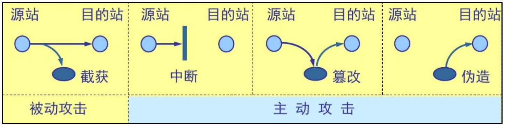
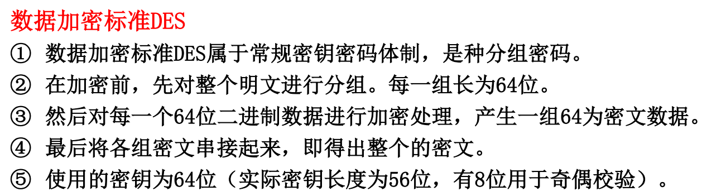
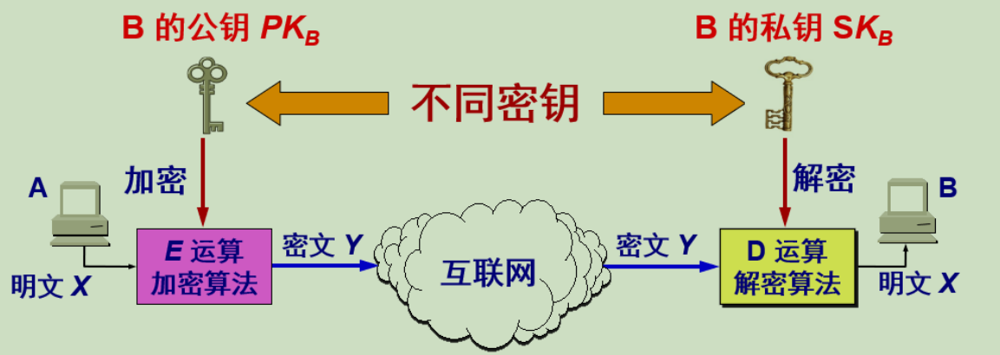

## @密码学

### 计算机网络面临的安全性威胁

大多数安全问题都是由于某些恶意的人企图获得某种利益、引起别人注意、或者伤害他人而有意制造的。
计算机网络上的通信面临以下四种威胁：

*   截获——从网络上窃听他人的通信内容

*   中断——有意中断他人在网络上的通信

*   篡改——故意篡改网络上传送的报文

*   伪造——伪造信息在网络上传送

截获信息的攻击称为被动攻击，而更改信息和拒绝用户使用资源的攻击称为主动攻击

**计算机网络安全问题可以分成4个相互交织的领域：**
①保密：防止被窃听
②认证：确定通信用户的身份
③不可否认：不可抵赖的电子签名
④完整性控制：防止信息被篡改

如果不论截取者获得了多少密文，但在密文中都没有足够的信息来唯一地确定出对应的明文，则这一密码体制称为**无条件安全**的，或称为理论上是不可破的

如果密码体制中的密码不能被可使用的计算资源破译，则这一密码体制称为在**计算上是安全的**

**密码学=密码编码学+密码分析学**

**两个基本的密码学原则：**

1、消息必须包含一定的冗余度。-—-冗余度

2、需要采取某种方法来对抗重放攻击。-—-新鲜度

**重放攻击**：使用截获数据包的身份信息伪造数据包

## @对称密钥算法

*   对称密钥密码学：发送方和接收方的密钥相同

    即加密密钥与解密密钥是相同的密码体制。这种加密系统又称为对称密钥系统。

*   公开密钥密码学：发送方使用接收方的公钥进行加密，接收方使用自己的私钥进行解密

**数据加密标准DES**

>   初始替换
>   16轮一样的函数应用，每一轮使用不同的48bit密钥最终替换

对称密钥的保密性仅取决于对密钥的保密，而算法是公开的

目前较为严重的问题是DES的密钥的长度

**对称加密AES**解决了这个问题

数据128bit成组加密     128，192，or 256 bit keys

## @公开密钥密码体系

发送者4用B的公钥PKB对明文义加密（E运算）后，接收者B用自己的私SKB解密（D运算）

在计算机上可容易地产生成对的PK和SK一公密码体制中最核心

## @数字签名

>   数字签名（又称公钥数字签名）是只有信息的发送者才能产生的别人无法伪造的一段数字串，这段数字串同时也是对信息的发送者发送信息真实性的一个有效证明。它是一种类似写在纸上的普通的物理签名，但是使用了公钥加密领域的技术来实现的，用于鉴别数字信息的方法。一套数字签名通常定义两种互补的运算，一个用于签名，另一个用于验证。数字签名是非对称密钥加密技术与数字摘要技术的应用
>

*   报文鉴别一—接收者能够核实发送者对报文对签名
*   报文的完整性——发送者事后不能抵赖对报文的签名
*   不可否认——接收者不能伪造对报文的签名

**数字签名的实现**

*   因为除A外没有别人能具有A的私钥，所以除A外没有别人能产生这个密文。
    因此B相信报文X是A签名发送的。---**确认是A发送的**

*   若A要抵赖曾发送报文给B，B可讲明文和对应的密文出示给第三者。第三
    者很容易用A的公钥去证实A确实发送X给B。---**不可抵赖**

*   反之，若B将X伪造成X’，则B不能在第三者前出示对应的密文。这样就证
    明B伪造了报文。---**不可伪造**