# 传输层

>   只有主机才有的层次

1.  传输层提供进程和进程之间的逻辑通信
    	网络层提供主机之间的逻辑通信

2.  复用和分用

3.  传输层对收到的报文进行差错检测

4.  传输层的两种协议

### 传输层的寻址与端口

复用：应用层所有的应用进程都可以通过传输层再传输到网络层

分用：传输层从网络层收到数据后交付指明的应用进程

逻辑端口/软件端口端口是传输层的SAP，标识主机中的应用进程。端口号只有本地意义，在因特网中不同计算机的相同端口是没有联系的

端口号长度为16bit，能表示65536个不同的端口号

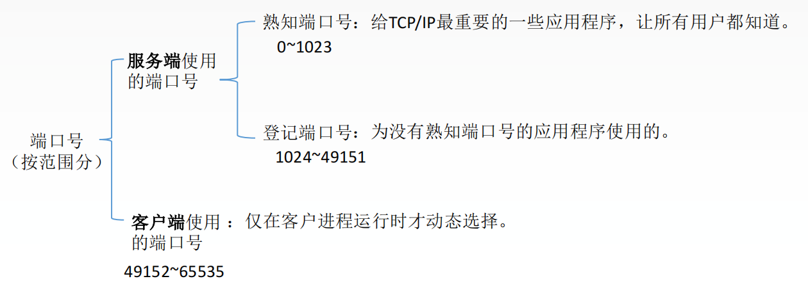

| 应用程序 | FTP文件传输 | TELNET远程登陆 | SMTP邮件传输 | DNS  | TFTP简单文件传送协议 | HTTP | SNMP简单网络管理协议 |
| -------- | ----------- | -------------- | ------------ | ---- | -------------------- | ---- | -------------------- |
| 端口号   | 21          | 23             | 25           | 53   | 7788                 | 80   | 161                  |

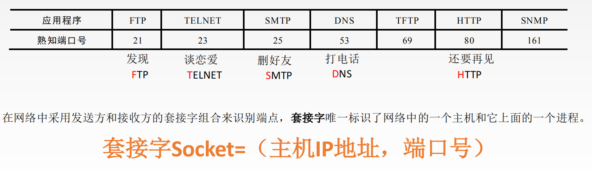

## @传输协议的要素

## @@@拥塞控制

### @@无线问题

## @Internet传输协议：UDP

### @@@UDP概述

>   **无连接的用户数据报协议**

UDP传送数据之前不需要建立连接，收到UDP报文后也不需要给出任何确认

不可靠，无连接，时延小，适用于小文件

**特点**

1.UDP是无连接的，减少开销和发送数据之前的时延

2.UDP使用最大努力交付，即不保证可靠交付

3.UDP是面向报文的，适合**一次性传输少量数据**的网络应用

4.UDP无拥塞控制，适合很多实时应用

5.UDP首部开销小，8B，TCP 20B

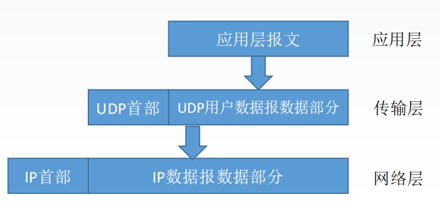

应用层给UDP多长的报文，UDP就照样发送，即一次发一个完整报文

### UDP首部格式

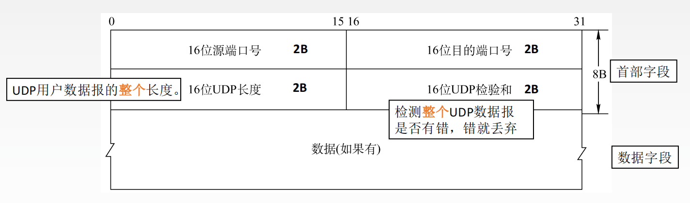

分用时，找不到对应的目的端口号，就丢弃报文，并给发送方发送ICMP“端口不可达”差错报告报文

### UDP校验

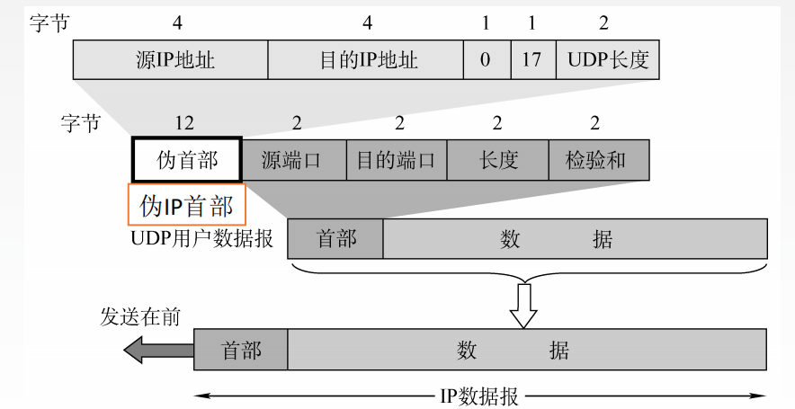

伪首部只有在计算检验和时才出现，不向下传送也不向上递交

17：封装UDP报文的IP数据报首部协议字段是17

UDP长度：UDP首部8B+数据部分长度（不包括伪首部）

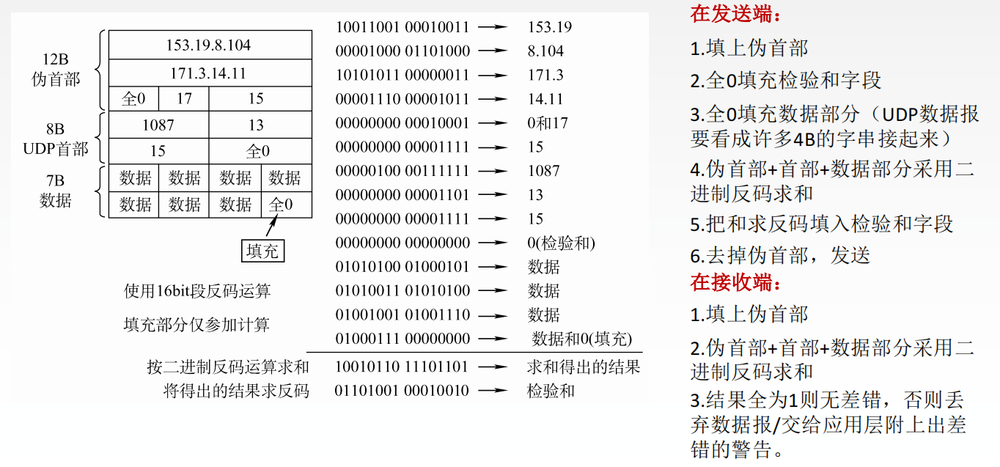

### @@远程过程调用

### @@实时传输协议

## @Internet传输协议：TCP

>   **面向连接的传输控制协议TCP**

传送数据之前必须建立连接，数据传送结束后要释放连接。不提供广播或多播服务。由于TCP要提供可靠的面向连接的传输服务，因此不可避免增加了许多开销：确认、流量控制、计时器及连接管理等

可靠，面向连接，时延大，适用于大文件

**特点**

1.TCP是面向连接（虚连接）的传输层协议

2.每一条TCP连接只能有**两个端点**，每一条TCP连接只能是点对点的

3.TCP提供可靠交付的服务，无差错、不丢失、不重复、按序到达。**可靠有序，不丢不重**

4.TCP提供**全双工通信**。发送缓存准备发送的数据&已发送但尚未收到确认的数据接收缓存按序到达但尚未被接受应用程序读取的数据&不按序到达的数据

5.TCP面向字节流TCP把应用程序交下来的数据看成仅仅是一连串的无结构的字节流

**流：流入到进程或从进程流出的字节序列**

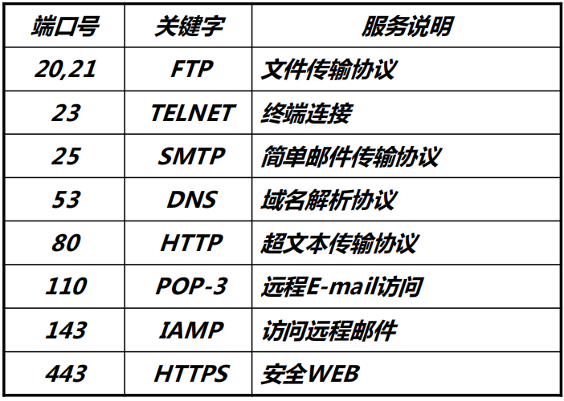

### TCP报文段首部格式

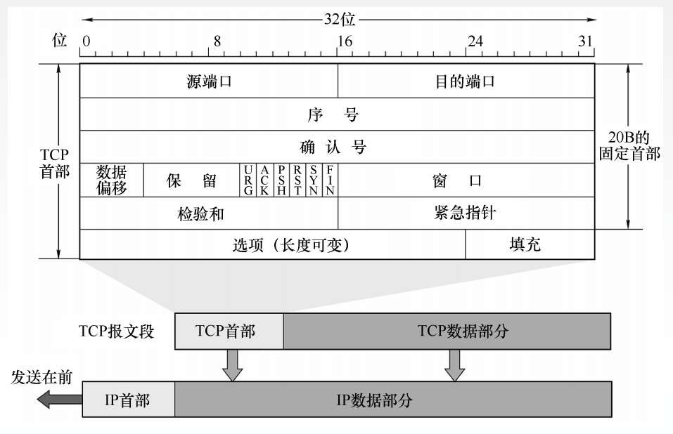

序号：在一个TCP连接中传送的字节流中的每一个字节都按顺序编号，本字段表示本报文段所发送数据的第一个字节的序号

确认号：在发送确认报文中，期望收到对方**下一个报文段**的第一个数据字节的序号。若确认号为N，则证明到序号N-1为止的所有数据都已正确收到

数据偏移（首部长度）：TCP报文段的数据起始处距离TCP报文段的起始处有多远，以4B位单位，即1个数值是4B

**6个控制位**

**紧急位** URG:URG=1时，标明此报文段中有紧急数据，是高优先级的数据，应尽快传送，不用在缓存里排队，配合紧急指针字段使用

**确认位** ACK:ACK=1时确认号有效，在连接建立后所有传送的报文段都必须把ACK置为1

**推送位** PSH:PSH=1时，接收方尽快交付接收应用进程，不再等到缓存填满再向上交付

**复位** RST:RST=1时，表明TCP连接中出现严重差错，必须释放连接，然后再重新建立传输链接

**同步位** SYN:SYN=1时，表明是一个连接请求/连接接受报文

**终止位** FIN:FIN=1时，表明此报文段发送方数据已发完，要求释放连接

窗口：指的是发送本报文段的一方的**接收窗口**，即现在允许对方发送的数据量

检验和：检验首部+数据，检验时要加上12B伪首部，第四个字段为6

紧急指针：URG=1时才有意义，指出本报文段中紧急数据的字节数

选项：最大报文段长度MSS、窗口扩大、时间戳、选择确认…

### TCP连接管理

TCP连接的建立采用**客户----服务器方式**，主动发起连接建立的应用进程叫做客户，而被动等待连接建立的应用进程叫服务器

#### TCP的连接建立

**三次握手**

假设运行在一台主机（客户）上的一个进程想与另一台主机（服务器）上的一个进程建立一条连接，客户应用进程首先通知客户TCP，他想建立一个与服务器上某个进程之间的连接，客户中的TCP会用以下步骤与服务器中的TCP建立一条TCP连接：

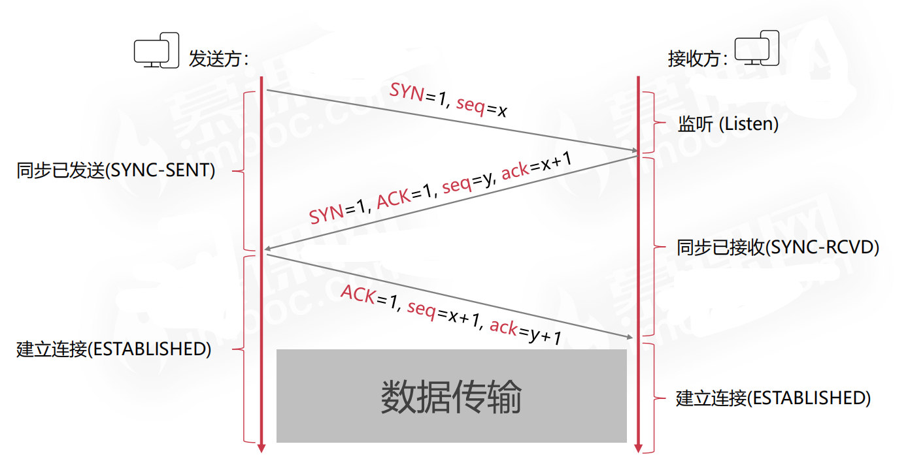

**ROUND 1**：客户端发送**连接请求报文段**，无应用层数据
SYN=1，`seq`=x（随机）   SYN=1为连接请求报文段     `seq`为序号位  随机产生

**ROUND 2**：服务器端为该TCP连接**分配缓存和变量**，并向客户端返回**确认报文段**，允许连接，无应用层数据
SYN=1，ACK=1，`seq`=y（随机），ack=x+1

**ROUND   3**：客户端为该TCP连接**分配缓存和变量**，并向服务器端返回确认的确认，可以携带数据
SYN=0，ACK=1，`seq`=x+1，ack=y+1

### TCP连接释放

**四次挥手**

参与一条TCP连接的两个进程中的任何一个都能终止该连接，连接结束后，主机中的“资源”（缓存和变量）将被释放

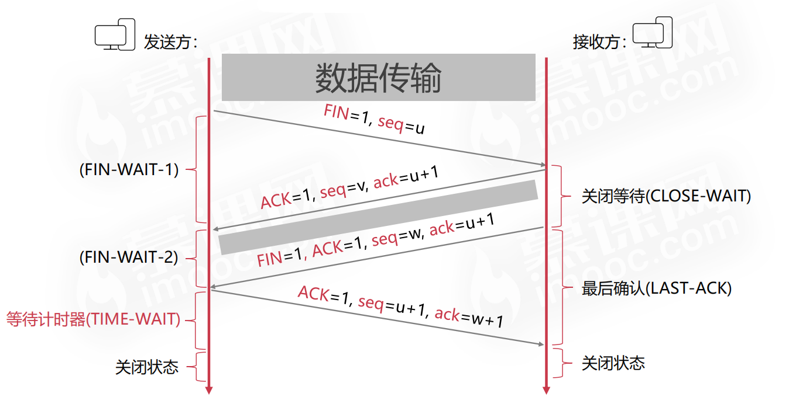

**ROUND 1**：客户端发送连接释放报文段，停止发送数据，主动关闭TCP连接
FIN=1，`seq`=u   FIN为结束位   

**ROUND 2**：服务器端回送一个确认报文段，客户到服务器这个方向的连接就释放了——**半关闭状态**
ACK=1，`seq`=V，ack=u+1

**ROUND  3**：
服务器端发完数据，就发出连接释放报文段，主动关闭TCP连接
FIN=1，ACK=1，`seq`=w，ack=u+1

**ROUND   4**：
客户端回送一个确认报文段，再等到时间等待计时器设置的2MSL（最长报文段寿命）后，连接彻底关闭ACK=1，`seq`=u+1，ack=W+1

### TCP的连接状态

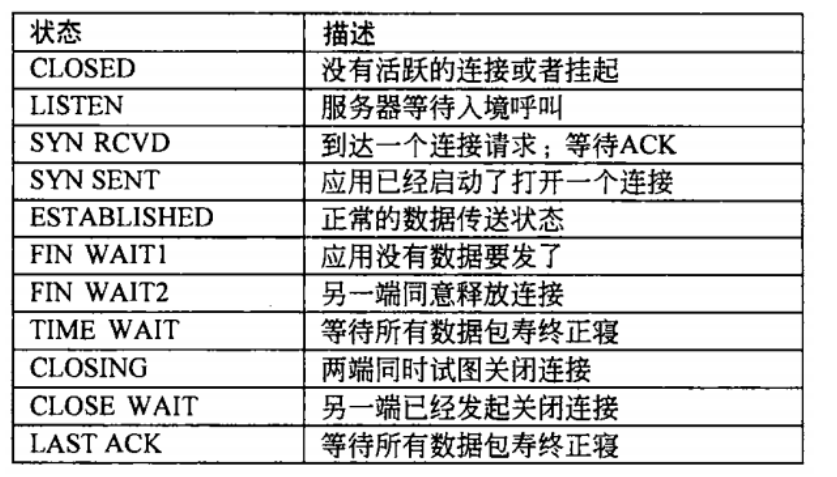

### TCP可靠传输

保证接收方进程从缓存区读出的字节流与发送方发出的字节流是完全一样的

**实现机制**

1.校验   2.序号   3.确认    4.重传

一个字节占一个序号
序号字段指的是一个报文段第一个字节的序号

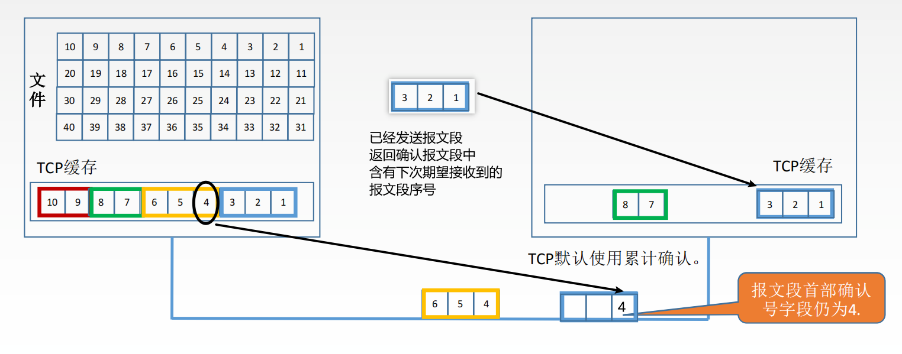

若下次没有接收到 4开头的报文段   而是其他  仍然接收   但发送的确认请求中确认字段仍为 4

**重传**

确认重传不分家，TCP的发送方在**规定的时间**内没有收到确认就要重传已发送的报文段。超时重传

TCP采用自适应算法，动态改变重传时间**RTTs**（加权平均往返时间）

为了避免等待收到确认报文时间过长，采用冗余ACK（冗余确认）

**冗余ACK**

每当比期望序号大的失序报文段到达时，发送一个**冗余ACK**，指明下一个期待字节的序号

发送方已发送1，2，3，4，5报文段

接收方收到1，返回给1的确认（确认号为2的第一个字节）

接收方收到3，仍返回给1的确认（确认号为2的第一个字节）

接收方收到4，仍返回给1的确认（确认号为2的第一个字节）

接收方收到5，仍返回给1的确认（确认号为2的第一个字节）

发送方收到**3个对于报文段1的冗余ACK** → 认为2报文段丢失，**立刻重传**2号报文段             **快速重传**

### TCP流量控制

流量控制：让发送方慢点，要让接收方来得及接收

TCP利用滑动窗口机制实现流量控制

在通信过程中，接收方根据自己接收缓存的大小，动态地调整发送方的发送窗口大小，即接收窗口`rwnd`（接收方设置确认报文段的窗口字段来将`rwnd`通知给发送方），发送方的发送窗口取接收窗口`rwnd`和拥塞窗口`cwnd`的最小值

**发送窗口大小可以动态变化**

A向B发送数据，连接建立时，B告诉A:“我的`rwnd`=400（字节）”，设每一个报文段100B，报文段序号初始值为1

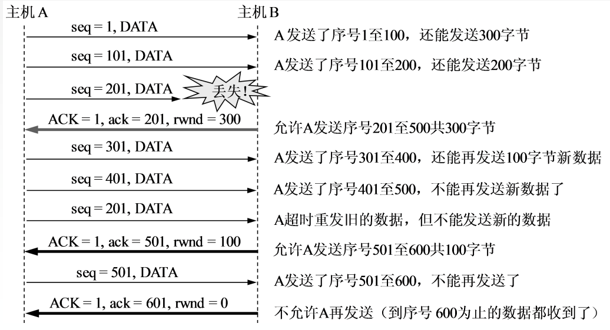

TCP为每一个连接设有一个持续计时器，只要TCP连接的一方收到对方的零窗口通知，就启动持续计时器

若持续计时器设置的时间到期，就发送一个零窗口探测报文段。接收方收到探测报文段时给出现在的窗口值

若窗口仍然是0，那么发送方就重新设置持续计时器

### TCP拥塞控制

出现拥塞的条件：
对资源需求的总和 > 可用资源   **（全局性）**

网络中有许多资源同时呈现供应不足网络性能变坏网络吞吐量将随输入负荷增大而下降拥塞控制：
防止过多的数据注入到网络中

#### 拥塞控制四种算法

慢开始     拥塞避免    快重传       快恢复

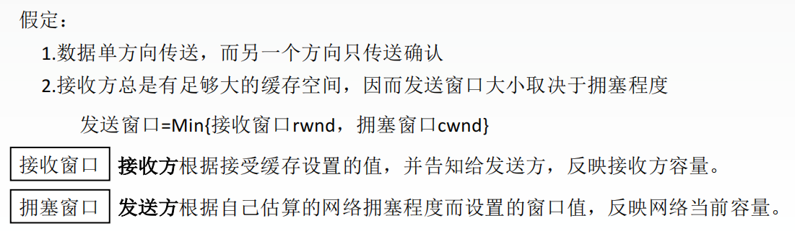

#### 慢开始和拥塞避免

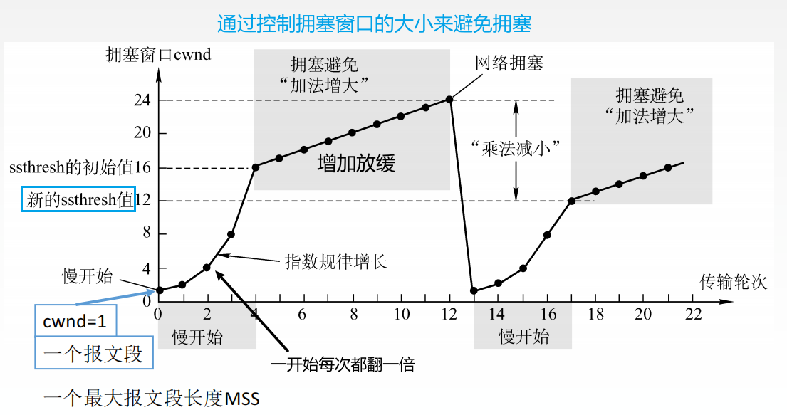

一个传输轮次：发送了一批报文段并收到它们的确认的时间
一个往返时延RTT
开始发送一批拥塞窗口内的报文段到开始发送下一批拥塞窗口内的报文段的时间

#### 快重传和快恢复

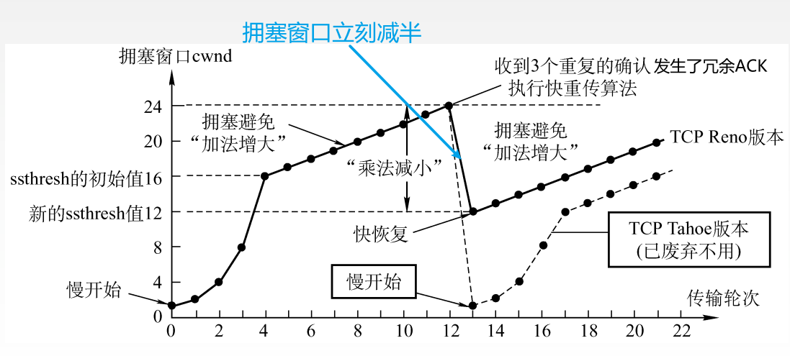

### @@TCP未来

### @@性能问题

### @@延迟容忍网络

