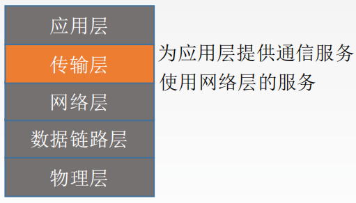

# 传输层

>   只有主机才有层次

1.  传输层提供进程和进程之间的逻辑通信
    	网络层提供主机之间的逻辑通信

2.  复用和分用

3.  传输层对收到的报文进行差错检测

4.  传输层的两种协议

### 传输层的寻址与端口

复用：应用层所有的应用进程都可以通过传输层再传输到网络层

分用：传输层从网络层收到数据后交付指明的应用进程

逻辑端口/软件端口端口是传输层的SAP，标识主机中的应用进程。端口号只有本地意义，在因特网中不同计算机的相同端口是没有联系的

端口号长度为16bit，能表示65536个不同的端口号

## @传输协议的要素

## @@@拥塞控制

### @@无线问题

## @Internet传输协议：UDP

### @@@UDP概述

>   无连接的用户数据报协议

UDP传送数据之前不需要建立连接，收到UDP报文后也不需要给出任何确认

不可靠，无连接，时延小，适用于小文件

**特点**

1.UDP是无连接的，减少开销和发送数据之前的时延

2.UDP使用最大努力交付，即不保证可靠交付

3.UDP是面向报文的，适合一次性传输少量数据的网络应用

4.UDP无拥塞控制，适合很多实时应用

5.UDP首部开销小，8B，TCP20B

应用层给UDP多长的报文，UDP就照样发送，即一次发一个完整报文

### UDP首部格式

分用时，找不到对应的目的端口号，就丢弃报文，并给发送方发送ICMP“端口不可达”差错报告报文

### UDP校验

伪首部只有在计算检验和时才出现，不向下传送也不向上递交

17：封装UDP报文的IP数据报首部协议字段是17

UDP长度：UDP首部8B+数据部分长度（不包括伪首部）

### @@远程过程调用

### @@实时传输协议

## @Internet传输协议：TCP

>   面向连接的传输控制协议TCP

传送数据之前必须建立连接，数据传送结束后要释放连接。不提供广播或多播服务。由于TCP要提供可靠的面向连接的传输服务，因此不可避免增加了许多开销：确认、流量控制、计时器及连接管理等。

可靠，面向连接，时延大，适用于大文件。

**特点**

1.TCP是面向连接（虚连接）的传输层协议

2.每一条TCP连接只能有两个端点，每一条TCP连接只能是点对点的

3.TCP提供可靠交付的服务，无差错、不丢失、不重复、按序到达。可靠有序，不丢不重

4.TCP提供全双工通信。发送缓存准备发送的数据&已发送但尚未收到确认的数据接收缓存按序到达但尚未被接受应用程序读取的数据&不按序到达的数据5.TCP面向字节流TCP把应用程序交下来的数据看成仅仅是一连串的无结构的字节流

**流：流入到进程或从进程流出的字节序列**

### TCP报文段首部格式

序号：在一个TCP连接中传送的字节流中的每一个字节都按顺序编号，本字段表示本报文段所发送数据的第一个字节的序号

确认号：期望收到对方下一个报文段的第一个数据字节的序号。若确认号为N，则证明到序号N-1为止的所有数据都已正确收到

数据偏移（首部长度）：TCP报文段的数据起始处距离TCP报文段的起始处有多远，以4B位单位，即1个数值是4B

### @@TCP未来

### @@性能问题

### @@延迟容忍网络

