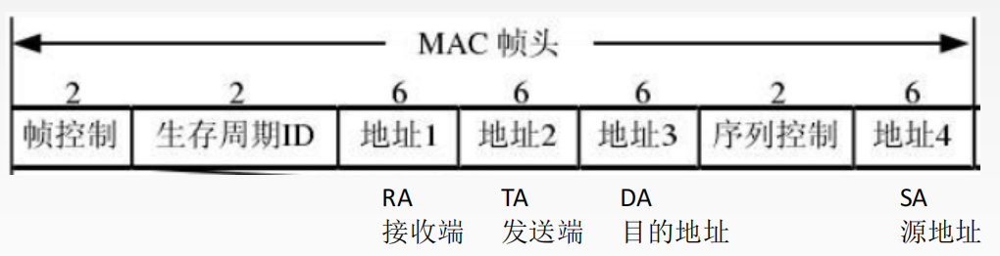

## @信道分配问题

### 局域网的数据链路层

局域网最主要的特点是：

*   网络为一个单位所拥有；

*   地理范围和站点数目均有限。

局域网具有如下主要优点：
1.具有广播功能，从一个站点可很方便地访问全网。局域网上的主机可共享连接在局域网上的各种硬件和软件资源
2.便于系统的扩展和逐渐地演变，各设备的位置可灵活调整和改变
3.提高了系统的可靠性、可用性和残存性

### 局域网拓扑结构

### 共享信道问题

通过媒体共享技术解决

**静态划分信道**

1.频分复用

2.时分复用

3.波分复用

4.码分复用

**动态媒体接入控制（多点接入）**
1.随机接入
2.受控接入，如多点线路探询（polling），或轮询。

## @多路访问协议

### 介质访问控制概述

介质访问控制是指将传输介质**带宽有效地分配**给网上各节点用户的方法

**同步控制**

*   为每个节点分配一个专用固定的容量
*   类似频分多路复用或十分多路复用

**异步控制**

*   把信道容量动态分配给每个需要的节点
*   响应用户的即时需要

#### 异步控制实现方式

#### 共享介质访问控制

介质访问控制协议（MAC）：将传输介质的容量有效地分配给网上各节点用户的方法

#### 信道系统竞争以及三个问题

### ALOHA协议

分为纯ALOHA协议  和  时隙ALOHA协议

**两者区别**

1.纯ALOHA比时隙ALOHA吞吐量更低，效率更低
2.纯ALOHA想发就发，时隙ALOHA只有在时间片段开始时才能发

### 载波侦听多路访问

## @以太网

以太网（Ethernet）是一种**基带总线局域网规范**，是当今现有局域网采用的最通用的通信协议标准。以太网络使用CSMA/CD（载波监听多路访问及冲突检测）技术

以太网在局域网各种技术中占统治性地位：
1.造价低廉（以太网网卡不到100块）
2.是应用最广泛的局域网技术
3.比令牌环网、ATM网便宜，简单
4.满足网络速率要求：10Mb/s~10Gb/s

**以太网提供无连接、不可靠的服务**

无连接：发送方和接收方之间无“握手过程”。
不可靠：不对发送方的数据帧编号，接收方不向发送方进行确认，差错帧直接丢弃，差错纠正由高层负责。

以太网只**实现无差错接收，不实现可靠传输**

### 以太网传输介质与拓扑结构的发展

### 10BASE-T以太网

### 适配器与MAC地址

### 以太网MAC帧

### 高速以太网

## @@无线局域网

>   IEEE802.11是无线局域网通用的标准，它是由IEEE所定义的无线网络通信的标准

### 802.11的MAC帧头格式

### 无线局域网的分类

1.  有固定基础设施无线局域网

2.  无固定基础设施无线局域网的自组织网络

### 固定基础设施无线局域网

@@宽带无线

@@蓝牙

@@RFID

## @数据链路层交换

### 网桥与以太网交换机

#### 以太网交换机的特点

*   以太网交换机实质上就是一个多接口的网桥
    通常都有十几个或更多的接口

*   每个接口都直接与一个单台主机或另一个以太网交换机相连，并且一般都工作在全双工方式

*   以太网交换机具有**并行性**。·能同时连通多对接口，使多对主机能同时通信
*   相互通信的主机都是独占传输媒体，无碰撞地传输数据  以太网交换机的每个接口是一个碰撞域
*   以太网交换机的接口有存储器，能在输出端口繁忙时把到来的帧进行缓存
*   以太网交换机是一种即插即用设备，其内部的帧交换表（又称为地址表）是通过自学习算法自动地逐渐建立起来的
*   以太网交换机使用了专用的交换结构芯片，用硬件转发，其转发速率要比使用软件转发的网桥快很多
*   以太网交换机的性能远远超过普通的集线器，而且价格并不贵
*   **用户独享带宽，增加了总容量**

### 以太网交换机的交换方式

### 以太网交换机自学习方法

### 虚拟局域网

>   虚拟局域网（VLAN）是一组逻辑上的设备和用户，这些设备和用户并不受物理位置的限制，可以根据功能、部门及应用等因素将它们组织起来，相互之间的通信就好像它们在同一个网段中一样，由此得名虚拟局域网。VLAN是一种比较新的技术，工作在OSI参考模型的第2层和第3层，一个VLAN就是一个广播域，VLAN之间的通信是通过第3层的路由器来完成的。与传统的局域网技术相比较，VLAN技术更加灵活，它具有以下优点： 网络设备的移动、添加和修改的管理开销减少；可以控制广播活动；可提高网络的安全性